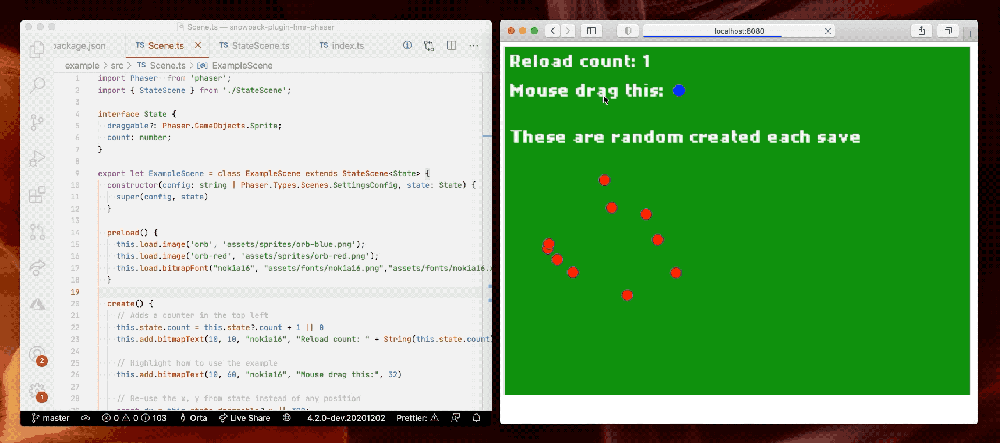

## Snowpack plugin for Phaser

A WIP Plugin for Hot Module Reloading in Phaser Scenes and Sprites in a Snowpack app.

Note: This isn't built out to be a perfect generic system for all use-cases. Yet, maybe. Expect to have to get your hands dirty because this hasn't hit a production system yet.



## Setup

Install the dependency `yarn add snowpack-plugin-hmr-phaser` then add it to your `snowpack.config.js`:

```diff
/** @type {import("snowpack").SnowpackUserConfig } */
module.exports = {
  // ...
-  plugins: ['@snowpack/plugin-typescript'],
+  plugins: ['@snowpack/plugin-typescript', 'snowpack-plugin-hmr-phaser'],
};
```

To use it, first make sure your game object is available as a global called `game`:

```ts
import Phaser from  "phaser"
import { ExampleScene } from "./Scene";

const config: Phaser.Types.Core.GameConfig = {
  type: Phaser.AUTO,
  scene: new ExampleScene("123", {})
};

const game = new Phaser.Game(config);
// @ts-ignore
window.game = game
```

or use `var game = ...`.


Today, it only supports Scenes. C&P this base scene into your project:

```ts
import Phaser  from 'phaser';

export class StateScene<State> extends Phaser.Scene {
  state: State;

  constructor(config: string | Phaser.Types.Scenes.SettingsConfig, state: State) {
    super(config);
    // @ts-ignore
    state._config = config;
    this.state = state;
  }
};
```

Then any scene you want HMR in looks like:

```ts
import Phaser  from 'phaser';
import { StateScene } from './StateScene';

// You use a single object to store all current state, rather than
// having all data stored on fields in the class:
//
interface State {
  draggable?: Phaser.GameObjects.Sprite;
}

// Yes, this is weird syntax, but it allows for a mutable copy of ExampleScene
// which is what will be hot-swapped when you press save.
//
export let ExampleScene = class ExampleScene extends StateScene<State> {
  constructor(config: string | Phaser.Types.Scenes.SettingsConfig, state: State) {
    super(config, state)
  }

  preload() {
    this.load.image('orb', 'assets/sprites/orb-blue.png');
    this.load.image('orb-red', 'assets/sprites/orb-red.png');
  }

  create() {
    // Re-use the x, y from state instead of any position
    const dx = this.state.draggable?.x || 20;
    const dy = this.state.draggable?.y || 20;

    // Just a shape which you can drag anywhere which 
    // should retain its position across the 
    const draggable = this.add.sprite(dx, dy, 'orb');
    const shape = new Phaser.Geom.Circle(20, 20, 20);
    draggable.setInteractive(shape, Phaser.Geom.Circle.Contains);
    this.input.setDraggable(draggable);

    draggable.on('pointerover', function () {
      draggable.setTint(0x7878ff);
    });

    draggable.on('pointerout', function () {
      draggable.clearTint();
    });

    draggable.on('drag', (_pointer: Phaser.Input.Pointer, dragX: number, dragY: number) => {
      draggable.x = dragX;
      draggable.y = dragY;
    });

    this.state.draggable = draggable;
};
```

Each time you save inside that file, the scene will be removed at runtime and then re-created with the same `state` object and config.

### TODO

I need to write a game with this before it should be considered production ready, in that time I expect that I will:

- Formalize what the design pattern for refreshable scenes look like
- Add support for Sprites
- Include a base class in this library for Scenes and Sprites
- Look into whether all of this can be a Phaser plugin, so that you only need to include it in the game config

### Working on This

The plugin is a single `index.js` file, with a corresponding `test.js`. Test your changes please.

There is an example project in [`./example`](./example) which you can `yarn install` in then use `yarn start` to work on the API.
